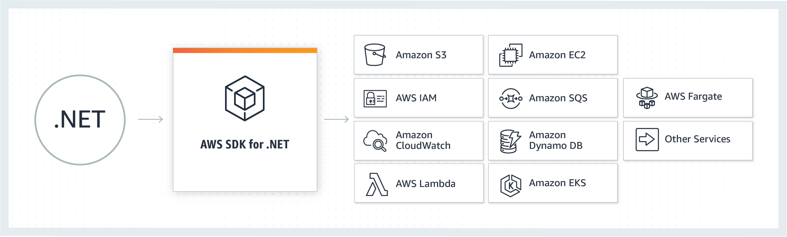
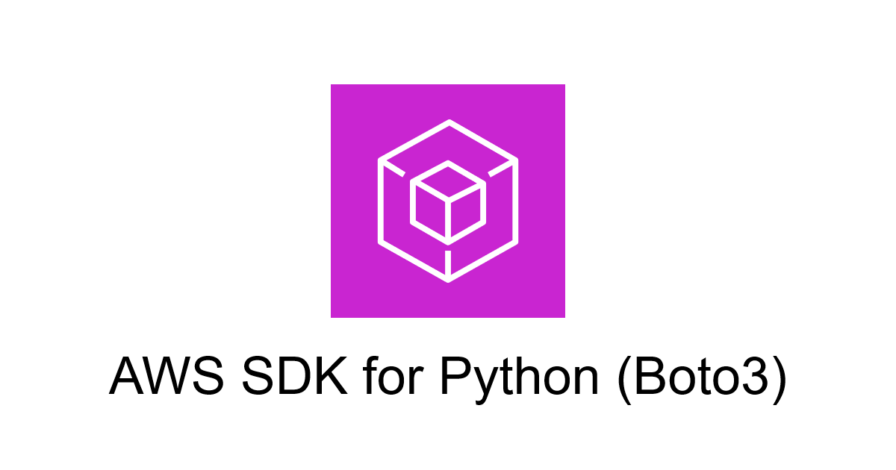
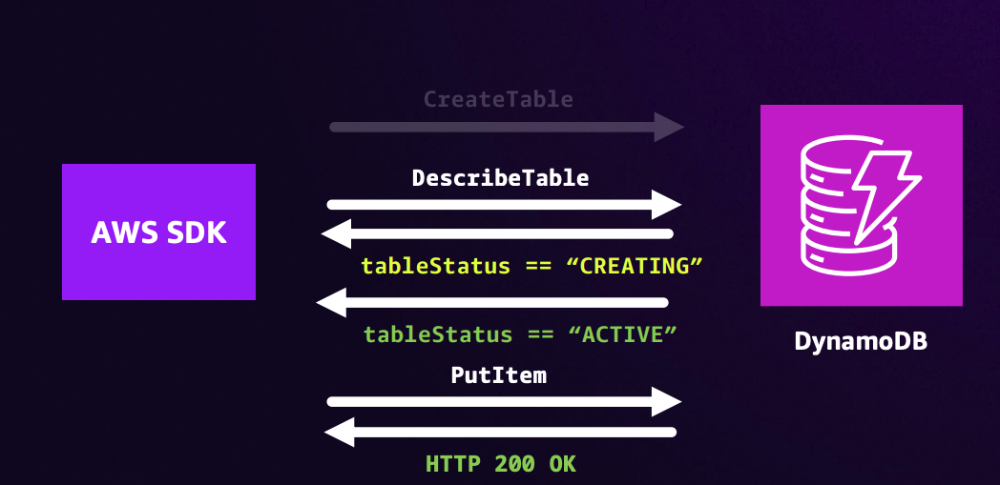
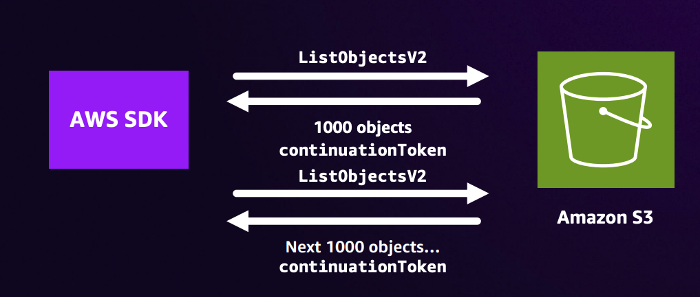
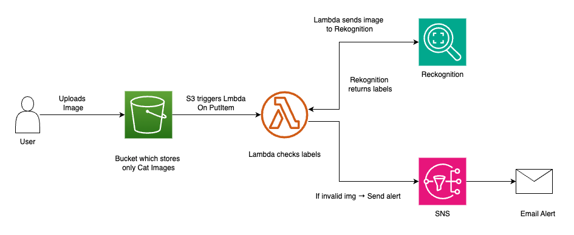

# AWS SDKs 

## What is an SDK?
A Software Development Kit (SDK) is a set of tools, libraries, and documentation designed to help developers build applications for a specific platform, framework, or service. SDKs simplify the process of interacting with complex systems by providing pre-built functions, APIs, and code samples.



## Key Features of AWS SDKs
- **Authentication:** SDKs integrate with AWS IAM, supporting access keys, IAM roles, or temporary credentials.
- **High-Level APIs:** Simplify complex operations.
- **Asynchronous Support:** SDKs support non-blocking calls, critical for performance in web apps or microservices.
- **Error Handling:** Built-in retry logic and detailed error messages.
- **Modular Design:** Newer SDKs (e.g., AWS SDK for JavaScript v3) are modular, allowing developers to import only needed components (e.g., @aws-sdk/client-s3).
- **Supported SDKs**: Python (boto3), JavaScript, Java, Go, .NET, etc.


## What are the benefits of an SDK?
SDKs offer several benefits across the development process that help developers create applications. They include:

### Efficient development
The AWS SDK provides pre-built libraries and components for services like S3, EC2, and DynamoDB. Developers can avoid writing low-level code and instead focus on building application logic, significantly reducing time spent on setup and debugging.

### Faster deployment
SDKs enable faster deployment by providing tools that let developers build and integrate applications quickly. They often support multiple platforms, allowing developers to deploy across multiple devices or operating systems rapidly.

### Integration
SDKs provide pre-built modules, components, packages, and tools for developers to build, test, and deploy software applications. They simplify developing, testing, and integration with other systems and services, code samples and tutorials, debugging tools, and code libraries. 


### Cost savings
By reducing development effort and simplifying cloud service integration, the AWS SDK helps lower operational and development costs. Automated features, like retry logic and request signing, reduce time spent on maintenance and troubleshooting.

## What are some uses of an SDK?
- Mobile app development
- Web development
- Cloud computing
- Internet of Things (IoT)
- Game development

## Why Use the SDK Instead of Direct API Calls?
✅ Handles authentication (e.g., AWS credentials)

✅ Manages retry logic, errors, pagination

✅ Saves you from crafting low-level HTTP requests

✅ Keeps you up-to-date with AWS API changes

✅ Available in many languages (Python, Node.js, Java, Go, C#, etc.)

## Getting started with boto3



Boto3 is the Amazon Web Services (AWS) SDK for Python. It allows developers to interact programmatically with AWS services such as S3, EC2, DynamoDB, Lambda, etc.

It abstracts the complex AWS API into a more Pythonic interface, making it easier to integrate cloud functionality into Python applications.


## Why Use Boto3?
- It's the official Python SDK for AWS.
- Supports automation of AWS tasks (e.g., launching EC2, managing S3 buckets).
- Can be used for both high-level and low-level AWS operations.

## Key Components of Boto3

### Session

- A session stores configuration state and allows you to create service clients and resources.

```python
import boto3
session = boto3.Session(profile_name='default')
s3 = session.client('s3')
```

### Client

- Low-level interfaces that map directly to AWS service APIs.
- When you need fine-grained control or access to all API operations.

```python
    s3 = boto3.client('s3', region_name='us-east-1')
    s3.upload_file('local.txt', 'my-bucket', 'remote.txt')
```

### Resource

- High-level, object-oriented abstractions for AWS services.

```python
    s3_resource = boto3.resource('s3')
    bucket = s3_resource.Bucket('my-bucket')
    bucket.upload_file('local.txt', 'remote.txt')
```

### Waiters

- Polls AWS services until a resource reaches a desired state.
- Example: ```waiter = client.get_waiter('instance_running')```




### Paginators

- Handles large datasets by iterating over paginated API responses.
- Example: ```paginator = client.get_paginator('list_objects_v2')```




## Setup and Configuration

  - Install Boto3 : `pip install boto3`
  - Configure AWS Credentials : Use AWS CLI (`aws configure`) you will be prompted to enter your Credentials.


## Common AWS SDK Use Cases
- **S3**: File storage and retrieval
  ```python
  s3 = boto3.client('s3')
  s3.put_object(Bucket='my-bucket', Key='test.jpg', Body=open('test.jpg', 'rb'))
  objects = s3.list_objects_v2(Bucket='my-bucket')['Contents']
  ```
- **Lambda**: Invoke functions
  ```python
  lambda_client = boto3.client('lambda')
  response = lambda_client.invoke(FunctionName='MyFunction', Payload='{}')
  ```
- **Rekognition**: Image analysis
  ```python
  rekognition = boto3.client('rekognition')
  response = rekognition.detect_labels(
      Image={'S3Object': {'Bucket': 'my-bucket', 'Name': 'test.jpg'}},
      MaxLabels=5
  )
  ```
- **SNS**: Send notifications
  ```python
  sns = boto3.client('sns')
  sns.publish(TopicArn='arn:aws:sns:us-east-1:123456789012:MyTopic', Message='Alert!')
  ```
- **Real-World**: Automation, CI/CD, monitoring, media processing

## Example

Code to upload files to a S3 bucket

```python
import boto3
import os

def upload_image_to_s3(file_path, bucket_name, object_name=None, region_name='us-east-1'):
    
    if object_name is None:
        object_name = os.path.basename(file_path)

    try:
        s3_client = boto3.client('s3', region_name=region_name)
        with open(file_path, "rb") as f:
            s3_client.upload_fileobj(f, bucket_name, object_name)
        print(f"Upload Successful: {object_name}")
        return True
    except Exception as e:
        print(f"Error: {e}")
        return False
    
if __name__ == "__main__":
    file_path = 'images/cat1.jpeg'  
    bucket_name = 'cats-only-bucket'
    upload_image_to_s3(file_path, bucket_name)
```
  

## Hands-On: Smart Media Detector

Imagine you run a “Cats Only” photo gallery—what happens if someone sneaks in a puppy pic? 🐶🚫

Every time a picture lands in your gallery, our smart checker takes a quick peek. If it spots anything other than a cat—say, a dog—it instantly rings the alarm to let you know. That way, you keep your collection purr-fectly on point without lifting a finger! 😸🔔


## Architecture



- Uploads an image to an S3 bucket.
- S3 triggers a lambda function when a new image is uploaded.
- Lambda receives the image event.Fetches the uploaded image.Sends the image to the Reckognition for image analysis (label detection).
- Reckognition detects objects, scenes, and concepts in the image. Returns a list of labels (e.g., “cat”, “dog”, “person”, etc.) with confidence scores to the lambda.
- Lambda compares detected labels with allowed labels (e.g., only “cat” is allowed).And determines if the image is acceptable or not.
- If the image violates the rules (e.g., it’s a dog or other animals), an email alert/notification is sent using SNS.

## Best Practices for AWS SDKs
- **Error Handling**:
  ```python
  try:
      response = s3_client.get_object(Bucket='my-bucket', Key='test.jpg')
  except s3_client.exceptions.NoSuchKey:
      print("File not found")
  ```
- **Security**:
  - Use IAM roles, not hard-coded keys
  - Least privilege: Restrict client permissions
  - Use Temporary Credentials

- **Pagination & Waiters**:
  - Many AWS APIs return up to 1,000 items per call. Always use paginators
  - When you need to poll for resource state (e.g., EC2 instance running), use waiters rather than custom loops

- **Call Resilience**:
  - Use Built-in retry logic
  ```python
    from botocore.config import Config
    cfg = Config(retries={'max_attempts': 10, 'mode': 'adaptive'})
    s3 = session.client('s3', config=cfg)
  ```

- Reuse Session and Client objects


## Resources
- boto3 Docs: https://boto3.amazonaws.com/v1/documentation/api/latest/index.html
- AWS SDK Examples: https://boto3.amazonaws.com/v1/documentation/api/latest/guide/examples.html
- AWS SDK Docs : https://aws.amazon.com/developer/tools/
- AWS Javascript SDK - https://docs.aws.amazon.com/AWSJavaScriptSDK/v3/latest/
